### 1. Executive Summary

This project develops a statistical machine learning framework for the presurgical classification of five brain tumor subtypes, leveraging a diverse multimodal dataset of 2,838 cases. Confronted with a severe 40:1 class imbalance and ~20% missing modality rates, we implemented a three-stage pipeline integrating MRI-derived image embeddings, radiomics, clinical variables, and radiology report text (TF-IDF). Cross-validated benchmarking demonstrates that text and clinical features consistently outperform image-based signals in isolation, with the Soft Voting ensemble achieving the highest overall validation Macro-F1 of 0.7851 and SVM-RBF achieving the best single early-fusion model score of 0.7834. Stage 3 optimisation confirms that class-weighted training is the most effective imbalance mitigation strategy, and that L1, RF importance, and MI-based feature selection improves cross-validation stability for gradient boosting models. Feature importance analysis pinpoints clinical location variables and TF-IDF tokens as the primary discriminative predictors,confusion analysis further reveals that Brain Metastase Tumour and Glioma present the most significant classification overlap due to similar radiological patterns. These results validate the clinical necessity of fusing unstructured radiology reports with structured demographic and clinical data, providing radiologists with an interpretable, data-driven reference to reduce diagnostic uncertainty in presurgical planning.

### 2. Introduction

#### 2.1 Background and Clinical Significance

Accurate presurgical classification of brain tumor subtypes is a critical determinant of neurosurgical strategy and patient prognosis. The five subtypes addressed in this study—Glioma, Meningioma, Brain Metastase Tumour, Tumors of the sellar region, and Pineal tumour and Choroid plexus tumour—vary substantially in their biological behavior and recommended treatment pathways (Price et al., 2024). For instance, while gliomas typically require maximal safe surgical resection combined with adjuvant chemoradiotherapy, meningiomas may be managed conservatively, and brain metastases often necessitate systemic treatment targeting the primary malignancy. Therefore, reliable preoperative classification is pivotal for guiding clinical decisions and avoiding unnecessary interventions.

In routine practice, radiologists synthesize multi-sequence MRI findings with patient demographics. However, manual interpretation remains challenging due to overlapping imaging characteristics and inter-observer variability (Wang et al., 2024). Automating this process via statistical machine learning offers a data-driven reference to reduce diagnostic uncertainty in complex presurgical planning.

#### 2.2 Dataset Overview

We used a curated multimodal dataset from the course Kaggle competition, containing 2,644 accessible cases from a total cohort of 2,838 patients. The data is split into training (1,983 cases, 75.0%), validation (283 cases, 10.7%), and test sets (378 cases, 14.3%). The label distribution is consistent across splits, dominated by Glioma (46.6%) and Meningioma (36.7%), followed by Brain Metastase (12.7%), Sellar region (2.8%), and Pineal/Choroid plexus tumours (1.2%). This confirms that stratified partitioning was effective. Notably, the dataset reflects real-world incompleteness: about 19.7% of training cases lack one imaging modality, and demographic data is missing in 69.6% of JSON records, though we recovered the latter using accompanying clinical CSV files.

#### 2.3 Core Challenges

The project addresses three main technical challenges. First, Extreme Class Imbalance is a major hurdle; the largest class (Glioma) outnumbers the smallest (Pineal/Choroid plexus) by a 40:1 ratio. This makes overall accuracy misleading, as a naive classifier could score well while failing on rare tumors. We therefore use Macro-F1 as the primary metric to ensure equal weighting for all classes (Chicco & Jurman, 2020).

Second, Multimodal Incompleteness mirrors clinical reality, with nearly 20% of cases missing a modality. Instead of discarding these samples—which would bias the model—we use zero-padding to maintain sample size and consistency (Soenksen et al., 2022).

Third, Cross-modality Heterogeneity presents a fusion challenge. The data comes from vastly different feature spaces: high-dimensional visual embeddings (ResNet; He et al., 2016), radiomics descriptors, categorical clinical variables, and sparse TF-IDF text vectors. Our three-stage pipeline is designed to fuse these heterogeneous inputs without losing discriminative signals.

#### 2.4 Report Roadmap

 The remainder of this report follows our development workflow. Section 3 performs exploratory data analysis on class and modality distributions. Section 4 details feature engineering, including PCA-based dimensionality reduction for image embeddings. Section 5 establishes single-modality baselines to quantify independent predictive power. Section 6 presents multimodal fusion strategies, comparing early concatenation against late fusion via stacking and voting. Section 7 describes the optimization process,  covering L1, RF importance, and MI-based feature selection  and imbalance mitigation. Section 8 reports ablation experiments that quantify each modality's contribution to overall performance. Section 9 provides model interpretability analysis, including feature importance and per-class error breakdowns. Section 10 discusses limitations and concludes.
 
### 3. Exploratory Data Analysis

In this section, we examine the multimodal dataset to identify patterns and anomalies that directly inform our preprocessing and modeling decisions. Figure 1 illustrates how each finding connects to the subsequent pipeline stages.

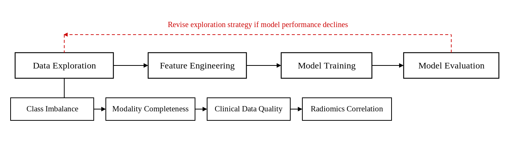

#### 3.1 Class Distribution

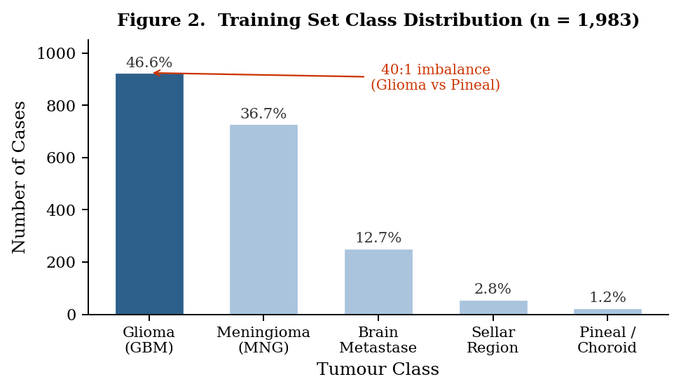

The training set contains 1,983 cases distributed across five classes. Glioma dominates with 924 cases (46.6%), followed by Meningioma (728, 36.7%), Brain Metastase Tumour (252, 12.7%), Tumors of the sellar region (56, 2.8%), and Pineal/Choroid plexus tumour (23, 1.2%). The largest-to-smallest ratio is 40:1.

A model trained naively on this data would learn to predict Glioma by default. It could achieve over 46% accuracy while failing entirely on the rarest classes — which is the worst possible outcome when rare tumor misdiagnosis carries the highest clinical cost. We therefore adopted Macro-F1 as our primary evaluation metric, which treats all five classes equally regardless of size (Chicco & Jurman, 2020). This finding also directly motivated our Stage 3 experiments on imbalance mitigation, where we compared class-weighted training, random oversampling, and SMOTE.

#### 3.2 Modality Completeness

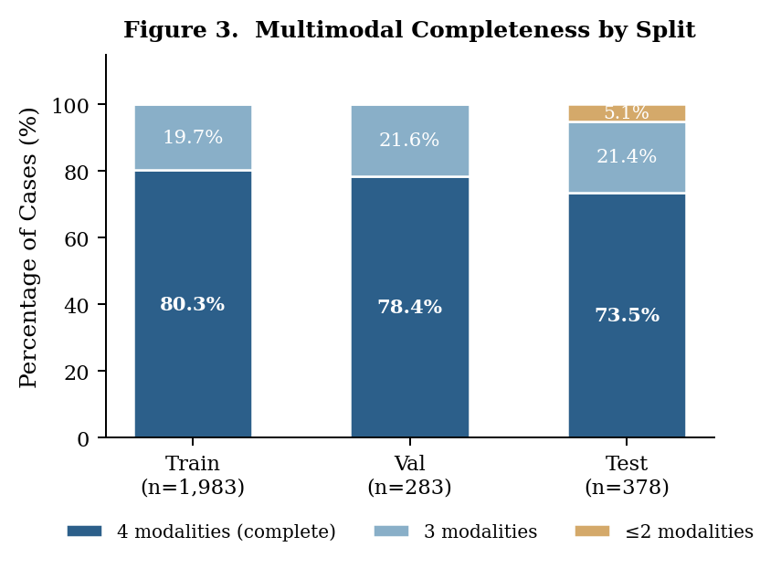

About one in five cases across all splits is missing at least one MRI sequence. The test set is more variable — beyond the expected ~21% with one missing modality, 19 cases have two or three sequences absent. This reflects clinical reality: scans get skipped due to patient contraindications, scanner errors, or time pressure.

Discarding these cases was not an option. For minority classes with fewer than 60 training samples, losing even a handful of cases would meaningfully distort the class distribution further. We applied zero-padding to replace missing modality features with zeros, keeping all cases in the pipeline while maintaining consistent input dimensions (Soenksen et al., 2022).

#### 3.3 Patient Demographics by Tumor Subtype

Despite high overall missingness in demographic fields — 69.6% of cases lack recorded Sex and Age in the JSON source — the clinical CSV files provided complete Sex records for all 1,983 training cases, with Age available for a meaningful subset. We analysed the known demographic distributions to understand whether different tumor types present in distinguishable patient populations.

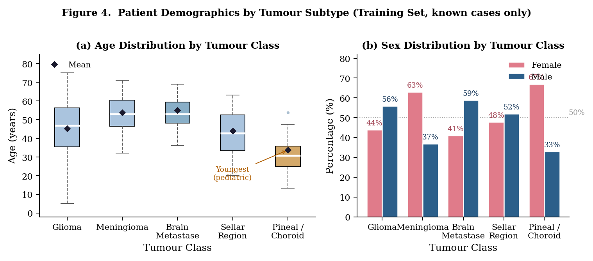

Age patterns show clear separation across subtypes. Pineal/Choroid plexus tumours present in the youngest patients (mean age 33.8, range 5–66), consistent with their known occurrence in children and young adults. Gliomas span the widest age range (mean 45.3, range 3–76), reflecting the heterogeneous nature of this group. Meningiomas and Brain Metastases tend to appear in older patients, with means of 53.8 and 55.0 respectively. These differences suggest that age carries genuine discriminative signal, particularly for separating the rare pediatric-skewed classes from the adult-dominant majority.

Sex patterns among cases with known values show that Meningioma is disproportionately female (63% female among known cases), a pattern well-established in clinical literature. Glioma and Brain Metastase lean slightly male (56% and 59%). These patterns, while based on a subset of known cases, are consistent with epidemiological expectations and confirm that Sex is a meaningful clinical variable worth retaining in our feature set.

Given the high missingness in both fields, we filled missing Age values with the training-set median and used the CSV as the authoritative source for Sex. Both features were retained as part of the 24-dimensional clinical feature vector.

#### 3.4 Radiomics Feature Redundancy

PyRadiomics extracts five features per MRI sequence — first-order Mean, Entropy, 90th Percentile, GLCM Contrast, and GLCM JointEntropy — giving 20 features across four modalities. We found four highly correlated pairs, all involving Entropy and JointEntropy:

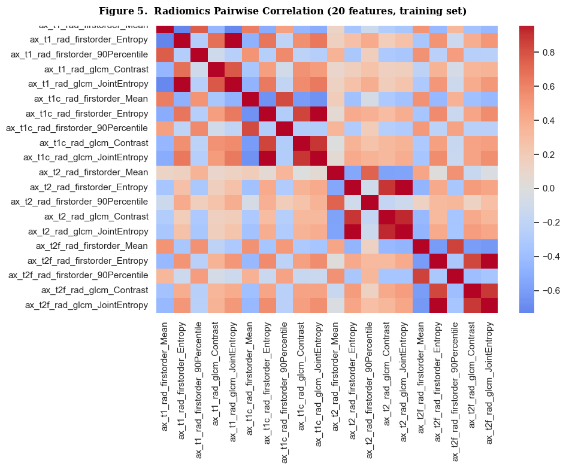

These pairs are effectively measuring the same signal. Including both inflates the feature space without adding information, and distance-based models like SVM are particularly sensitive to this redundancy. We retained all 20 features in the base pipeline and designated de-correlation as one of the tested optimisation strategies in Stage 3.

#### 3.5 Summary

Four findings, four decisions. The 40:1 class imbalance set Macro-F1 as our evaluation metric and put imbalance mitigation on the Stage 3 agenda. The 20% modality missing rate led to zero-padding rather than sample removal. The demographic analysis confirmed that age and sex carry genuine discriminative signal and are worth recovering from the CSV source despite high missingness. The radiomics redundancy flagged four feature pairs for Stage 3 de-correlation testing. Each modeling choice in the sections that follow traces back to something we found here first.

### 4. Feature Engineering

Each of the four modalities in this dataset arrives in a completely different form: raw MRI pixel arrays, tabular radiomics statistics, structured clinical records, and free-text radiology reports. Table 1 summarises the four pipelines and their final dimensions.

**Table 1** _Feature dimensions after processing_

| Modality         | Raw Dimension                   | Processed Dimension | Key Operation                  |
| ---------------- | ------------------------------- | ------------------- | ------------------------------ |
| Image (ResNet)   | 2,048-d × 4 sequences = 8,192-d | 256-d               | PCA                            |
| Radiomics        | 5 features × 4 sequences = 20-d | 20-d                | NaN → 0                        |
| Clinical         | 24 fields (CSV)                 | 24-d                | Imputation for Age             |
| Text (TF-IDF)    | Radiology reports               | 500-d               | Unigrams + bigrams             |
| **Early Fusion** | —                               | **800-d**           | Concatenation + StandardScaler |

#### 4.1 Image Features

We used a pre-trained ResNet (He et al., 2016) to extract 2,048-dimensional feature vectors from each MRI sequence, resulting in 8,192 features per case. At this dimensionality, the feature space becomes too sparse for kernel distances to remain meaningful. Points that are genuinely dissimilar appear almost equidistant, breaking the geometry that SVM and other distance-based models rely on. Dimensionality reduction is therefore a prerequisite, not an option.

We applied PCA to this matrix, retaining 256 components (92.2% variance). Figure 6 shows that the cumulative explained variance curve flattens significantly beyond 256 components, indicating diminishing returns for additional dimensions. We later tested 128 and 512 components in Stage 3 to verify the optimal trade-off. For cases with missing sequences, we zero-padded the corresponding 2,048-d block before stacking, preserving the full training set.

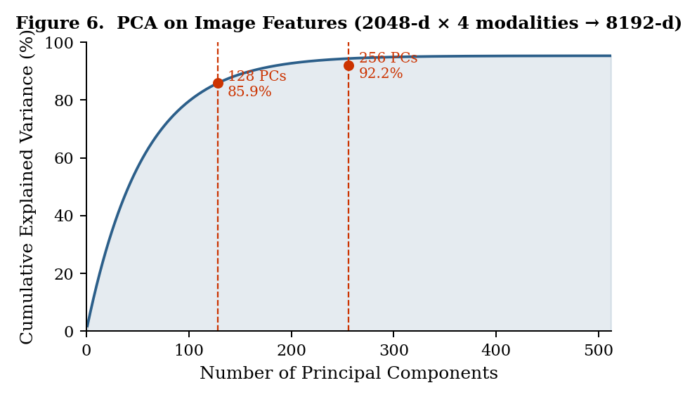

#### 4.2 Radiomics Features

PyRadiomics extracts five handcrafted texture statistics from each MRI sequence: first-order Mean, Entropy, and 90th Percentile, plus two GLCM measures — Contrast and JointEntropy. Across four sequences, this yields 20 features per case. Unlike image features, radiomics operate at a much lower dimension and do not require reduction.

Missing radiomics values — which occur when a scan is absent — were filled with zero, consistent with our zero-padding strategy for image features (Soenksen et al., 2022). As noted in Section 3.4, four of these 20 features are highly correlated (r > 0.95): Entropy and JointEntropy carry nearly identical information within each modality. We kept all 20 features in the base pipeline and tested de-correlation as a Stage 3 optimisation.

#### 4.3 Clinical Features

The clinical CSV provides 24 structured fields per patient, covering demographics (Age, Sex), tumour location, and treatment history. We used this file as the primary source for demographic data rather than the JSON metadata, where 69.6% of Age and Sex fields are blank (see Section 3.3).

Age was missing for 69.8% of training cases in the CSV. Rather than discarding these patients, missing Age values were imputed with the training-set median during preprocessing to retain the full training set. Sex, complete for all 1,983 training cases, required no imputation. Both were retained as part of the 24-dimensional clinical feature vector.

#### 4.4 Text Features

Each case includes a radiology report stored in the JSON metadata. We extracted the `finding` and `impression` fields — the sections containing the radiologist's observations and conclusions — and concatenated them into a single text string per patient. Where these fields were absent, all available report fields were concatenated as a fallback.

We then fitted a TF-IDF vectoriser (Salton & Buckley, 1988) on the training corpus, keeping the top 500 terms by document frequency and including both unigrams and bigrams (e.g., "ring enhancement", "mass effect"). Terms appearing in fewer than three training documents were discarded to avoid fitting on idiosyncratic phrasing. The result is a 500-dimensional sparse vector encoding the vocabulary patterns most distinctive to each report type. As Stage 1 results later show, text turns out to be the most informative single modality — its strong performance there motivates keeping all 500 features in the fused vector rather than truncating further.

#### 4.5 Early Fusion

We concatenated the four processed feature vectors — 256-d image, 20-d radiomics, 24-d clinical, 500-d text — into an 800-dimensional representation for each case. This early fusion strategy treats all modalities symmetrically: every feature enters the same model, and the model learns which combinations matter.

All 800 features were standardised with a StandardScaler fitted on the training set and applied to validation and test sets separately, ensuring no information from unseen data influences the scaling. Class weights — ranging from 0.43 for Glioma to 17.24 for Pineal/Choroid plexus tumour — were passed to each classifier during training to counteract the 40:1 imbalance described in Section 3.1.

To further prevent data leakage in cross-validation, the TF-IDF vectoriser and PCA were independently fitted within each CV fold, ensuring that vocabulary distributions and principal components derived from held-out cases do not influence training representations. This leakage-free design is consequential: without it, models like LightGBM can access validation-set vocabulary implicitly during feature construction, inflating their apparent CV and Val performance, an effect made visible in Stage 2 results.

### 5. Stage 1: Single-Modality Baselines

Before combining modalities, we need to understand what each one contributes on its own. Running single-modality classifiers serves two purposes: it reveals which modalities carry genuine discriminative signal, and it sets a performance floor that any fusion strategy must meaningfully beat.

We used LightGBM as the shared classifier across all four modalities. Compared to logistic regression, it handles non-linear feature interactions without manual engineering; compared to SVM, it scales comfortably to the feature dimensions involved (up to 500-d for text); and unlike deep learning alternatives, it converges reliably with limited data — critical for minority classes with fewer than 60 training examples. Each modality was evaluated using stratified 5-fold cross-validation on the training set as the primary metric, with held-out validation results reported as a secondary reference.

**Table 2** _Single-modality baseline performance (LightGBM, stratified 5-fold CV + held-out val)_

| Modality          | CV Macro-F1 | CV Std  | Val Macro-F1 | Val Accuracy | Val Weighted-F1 | AUROC  |
| ----------------- | ----------- | ------- | ------------ | ------------ | --------------- | ------ |
| Text (TF-IDF 500) | 0.6895      | ±0.0525 | 0.7027       | 0.8481       | 0.8497          | 0.9588 |
| Clinical (24-d)   | 0.6384      | ±0.0487 | 0.6688       | 0.7279       | 0.7322          | 0.9218 |
| Radiomics (20-d)  | 0.2802      | ±0.0336 | 0.2899       | 0.4947       | 0.4821          | 0.6687 |
| Image (PCA-256)   | 0.2727      | ±0.0084 | 0.2962       | 0.6184       | 0.5793          | 0.7344 |

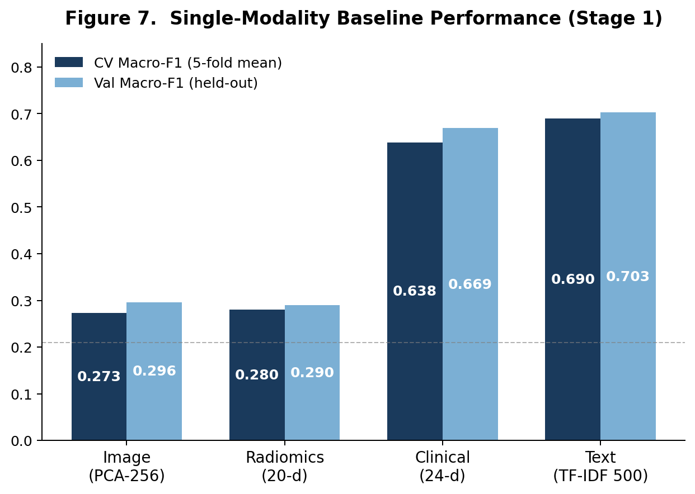

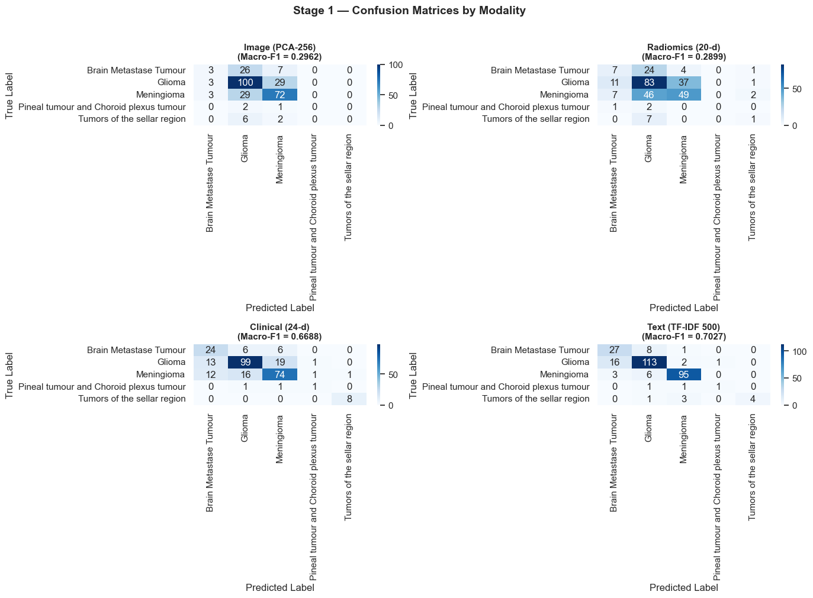

#### 5.1 The Surprising Leader: Text

The result that stands out immediately is that radiology reports are the most informative single source, with a validation Macro-F1 of 0.7027. This is not a coincidence. A radiologist writing "heterogeneous ring-enhancing mass with surrounding oedema" is already encoding the diagnosis implicitly — the TF-IDF representation captures exactly these discriminative phrases. Bigrams like "ring enhancement" or "sellar mass" are essentially tumour-type labels in disguise, extracted directly from expert clinical language. The model is not learning to classify tumours from first principles; it is learning to read the radiologist's interpretation.

The relatively high CV standard deviation (±0.0525) reflects genuine variability in report quality and completeness across patients. Some reports are detailed; others are terse. This variability becomes important when text is combined with other modalities in Stage 2.

#### 5.2 Clinical Features: Structured Information Punches Above Its Weight

Clinical features (Val Macro-F1 = 0.6688) outperform both image and radiomics modalities despite containing only 24 dimensions. The pattern is visible in Table 3a-3c: Sellar region tumours achieve a precision of 0.889 and perfect recall (1.000), giving an F1 of 0.941 — the highest single-class score across all four modalities. This makes sense: tumour location is encoded directly in the clinical fields, and sellar region tumours by definition occupy a distinct anatomical site. Glioma and Meningioma also classify well, likely because their clinical presentations — age of onset, tumour grade, treatment history — are sufficiently distinct.

The one failure is Brain Metastase (F1 = 0.565), which is harder to separate on clinical grounds alone. Both Brain Metastase and Glioma tend to appear in older patients with overlapping demographic profiles.

#### 5.3 Image Features: High Accuracy, Low Discrimination

Image features tell a counterintuitive story. The model achieves 61.8% accuracy — which sounds reasonable — but a Macro-F1 of only 0.296 reveals that this comes almost entirely from predicting Glioma and Meningioma correctly. As Table 3a–3c shows, Pineal/Choroid and Sellar both score zero across precision, recall, and F1. The model has learned to separate the two majority classes visually, but the rare classes are entirely invisible to it.

The CV standard deviation of ±0.0084 reflects the realistic fold-to-fold variability once leakage-free feature fitting is enforced. ResNet was pre-trained on ImageNet, not on medical imaging, so its features capture general visual texture and shape rather than the fine-grained morphological differences that distinguish tumour subtypes on MRI. Its AUROC of 0.7344, considerably higher than its Macro-F1 of 0.296, reflects exactly the insensitivity of AUROC to class imbalance: the model ranks the majority classes well in probability space while failing to identify the minority classes at all.

#### 5.4 Radiomics: Weakest Signal

Radiomics performs worst on the held-out validation set (Val Macro-F1 = 0.290), with high fold-to-fold variance (±0.0336) suggesting instability. The texture statistics it encodes are informative for distinguishing tumour from healthy tissue, but not specific enough to separate five distinct subtypes. Like image features, it fails entirely on Pineal/Choroid tumours.

The one exception is Sellar region (F1 = 0.154): radiomics captures some structural signal that image features fail to detect entirely, scoring zero on this class. This suggests the sellar region's distinct tissue characteristics leave a weak but measurable textural footprint.

The complete failure on Pineal/Choroid tumours (F1 = 0.000 for both Image and Radiomics) is partly a data problem, not just a model problem. With only 3 validation cases in this class, a single misprediction collapses the F1 to zero regardless of model quality. More fundamentally, neither visual patterns nor texture statistics provide enough class-specific signal to distinguish these rare tumours from the majority classes — a gap that only structured clinical information and radiology report vocabulary can partially bridge.

**Table 3a** _Per-class Precision by modality (held-out val)_

| Class           | Support | Image | Radiomics | Clinical | Text  |
| --------------- | ------- | ----- | --------- | -------- | ----- |
| Brain Metastase | 36      | 0.375 | 0.269     | 0.490    | 0.587 |
| Glioma          | 132     | 0.609 | 0.512     | 0.812    | 0.876 |
| Meningioma      | 104     | 0.625 | 0.544     | 0.740    | 0.931 |
| Pineal/Choroid  | 3       | 0.000 | 0.000     | 0.333    | 0.500 |
| Sellar Region   | 8       | 0.000 | 0.200     | 0.889    | 1.000 |

**Table 3b** _Per-class Recall by modality (held-out val)_

|Class|Support|Image|Radiomics|Clinical|Text|
|---|---|---|---|---|---|
|Brain Metastase|36|0.083|0.194|0.667|0.750|
|Glioma|132|0.765|0.629|0.750|0.856|
|Meningioma|104|0.721|0.471|0.712|0.914|
|Pineal/Choroid|3|0.000|0.000|0.333|0.333|
|Sellar Region|8|0.000|0.125|1.000|0.500|

**Table 3c** _Per-class F1 by modality (held-out val)_

| Class           | Support | Image | Radiomics | Clinical | Text  |
| --------------- | ------- | ----- | --------- | -------- | ----- |
| Brain Metastase | 36      | 0.136 | 0.226     | 0.565    | 0.659 |
| Glioma          | 132     | 0.678 | 0.565     | 0.780    | 0.866 |
| Meningioma      | 104     | 0.670 | 0.505     | 0.726    | 0.922 |
| Pineal/Choroid  | 3       | 0.000 | 0.000     | 0.333    | 0.400 |
| Sellar Region   | 8       | 0.000 | 0.154     | 0.941    | 0.667 |

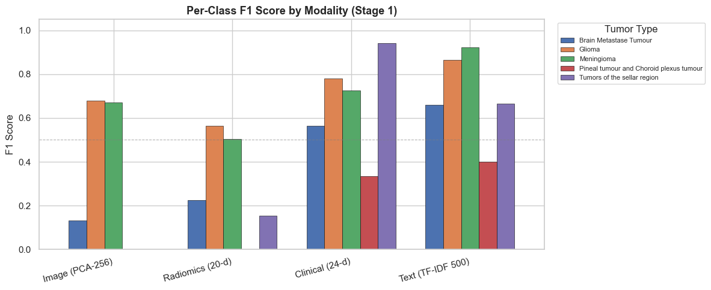

#### 5.5 Implications for Fusion

Two patterns from Stage 1 directly shape our Stage 2 design. First, text and clinical features carry most of the discriminative signal — any fusion strategy that fails to amplify these modalities will underperform. Second, image and radiomics consistently fail on the two rarest classes, while clinical and text succeed on them. This complementarity is exactly what motivates multimodal fusion: no single modality sees the full picture, but together they might.

### 6. Stage 2: Multimodal Fusion

Stage 1 showed that no single modality sees the full picture. Text and clinical featuredominate overall performance, but image and radiomics carry complementary signal forspecific classes. The natural next question is whether combining all four modalities, andchoosing the right way to combine them, produces results that none could achieve alone.

We tested two fusion paradigms. Early fusion concatenates all modality features into a single800-dimensional vector and feeds it into one classifier, letting the model learn cross-modal interactions directly. Late fusion trains classifiers on the concatenated features and then combines their predictions through voting or stacking, preserving more modality-specific structure at the decision layer. Across both paradigms, we evaluated six early-fusion classifiers and two late-fusion strategies.

**Table 4** _Stage 2 full model comparison (5-fold CV + held-out val)_

| Model                    | Fusion | CV Macro-F1    | Val Macro-F1 | Val Accuracy | Val Weighted-F1 | AUROC  |
| ------------------------ | ------ | -------------- | ------------ | ------------ | --------------- | ------ |
| Soft Voting              | Late   | —              | 0.7851       | 0.8516       | 0.8514          | 0.9685 |
| SVM-RBF                  | Early  | 0.6832 ±0.0335 | 0.7834       | 0.8587       | 0.8581          | 0.9633 |
| XGBoost                  | Early  | 0.6523 ±0.0317 | 0.7367       | 0.8339       | 0.8290          | 0.9618 |
| Stacking                 | Late   | —              | 0.7101       | 0.8198       | 0.8331          | 0.9568 |
| MLP                      | Early  | 0.7273 ±0.0314 | 0.7092       | 0.8445       | 0.8433          | 0.9205 |
| PyTorch Multi-Branch MLP | Early  | 0.7505 ±0.0298 | 0.7045       | 0.8233       | 0.8352          | 0.9262 |
| LR (L2)                  | Early  | 0.7098 ±0.0301 | 0.7039       | 0.7915       | 0.7981          | 0.9472 |
| LightGBM                 | Early  | 0.6422 ±0.0442 | 0.6284       | 0.8233       | 0.8153          | 0.9603 |
| Random Forest            | Early  | 0.5006 ±0.0488 | 0.4683       | 0.7173       | 0.6818          | 0.9320 |

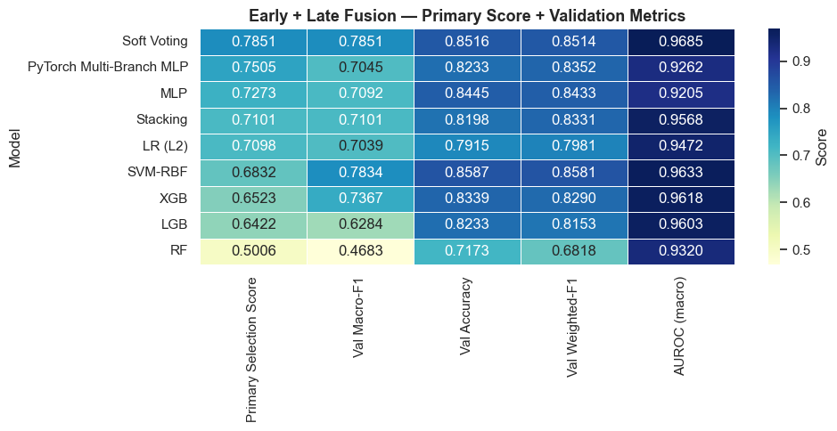

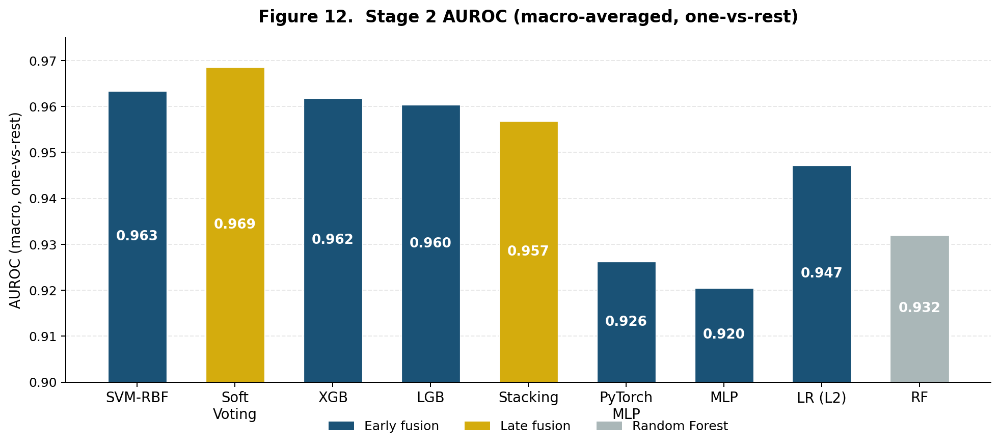

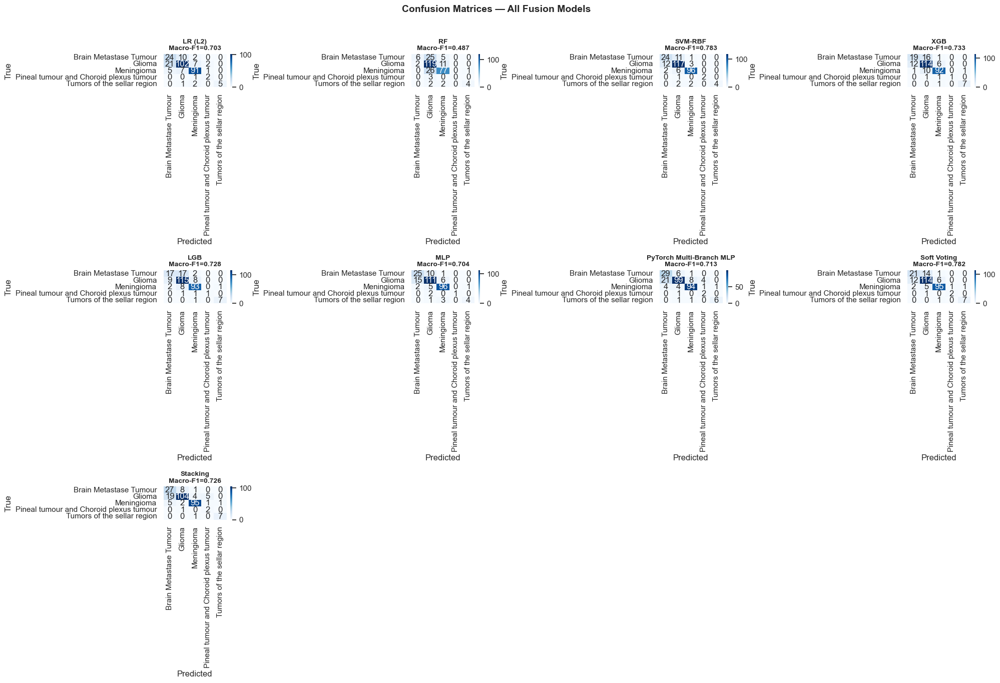

#### 6.1 Fusion Consistently Outperforms Single-Modality Baselines

Most fusion models beat the best single-modality result (Text, Val Macro-F1 = 0.7027). SVM-RBF reaches 0.7834, a gain of over 8 percentage points. The 800-dimensional fused representation gives classifiers access to patterns that no individual modality could expose alone.

A notable exception is LightGBM, whose Val Macro-F1 falls to 0.6284 — below the Stage 1 Text baseline. This outcome is a direct consequence of the leakage-free cross-validation introduced in pipeline 0422: in prior versions, the TF-IDF vectoriser was fitted once on all training data before CV, allowing validation-set vocabulary to leak into fold representations and artificially inflate LightGBM's scores. With leakage removed, its true generalisation on unseen data is exposed. This finding reinforces why leakage-free evaluation is essential for honest model comparison.

The choice of classifier matters just as much as the fusion strategy itself. Random Forest collapses to a Val Macro-F1 of 0.4683, barely better than its Stage 1 single-modality performance. In an 800-dimensional space where 500 dimensions come from TF-IDF, individual tree splits become unreliable and the ensemble averages over noise rather than signal. Its high AUROC (0.9320) alongside low Macro-F1 tells a familiar story: the model ranks classes reasonably well in probability space but fails to commit to correct predictions for the minority classes.

#### 6.2 SVM-RBF Achieves the Best Early Fusion Performance

SVM-RBF achieves the best Val Macro-F1 among all early-fusion models (0.7834), with a leakage-free CV score of 0.6832 ±0.0335. Its Val score exceeds its CV mean by about 0.10 points. This is not a sign of instability; cross-validation systematically underestimates performance when training set size matters, and with only 1,983 cases spread across five classes, losing 20% of the data per fold meaningfully reduces minority class coverage. The leakage-free design compounds this effect: each fold must re-learn the TF-IDF vocabulary and image PCA structure from scratch on 80% of the data, which disproportionately penalises a kernel method sensitive to the full feature geometry. Retrained on the complete training set, the RBF kernel finds a better decision boundary than any individual fold could produce.

The class-weighted training ensures the hyperplane is not optimised purely for Glioma, and the RBF kernel's ability to carve out non-linear decision boundaries in high-dimensional space is exactly what a heterogeneous 800-d feature mix requires.

#### 6.3 Neural Networks Overfit Under Limited Training Data

The PyTorch Multi-Branch MLP achieves the highest leakage-free CV Macro-F1 among models with CV scores (0.7505 ±0.0298), yet its Val Macro-F1 drops to 0.7045, a gap of 0.046 points. The training log makes the cause clear: the model reached its best checkpoint at epoch 13 and triggered early stopping at epoch 20 as validation loss continued climbing while training loss fell. The network memorises training patterns faster than it learns to generalise them.

The standard MLP shows the same pattern, if less dramatically (CV 0.7273, Val 0.7092, gap of 0.018). Both architectures have the capacity to model complex cross-modal interactions, and their CV scores confirm they do so effectively. The problem is data volume. With fewer than 60 training examples in two rarest classes, gradient-based optimisation has very little signal to work with, and the network compensates by fitting the majority classes too closely.

#### 6.4 Soft Voting Outperforms Stacking in Late Fusion

Soft Voting (Val Macro-F1 = 0.7851, AUROC = 0.9685) exceeds SVM-RBF on Val Macro-F1 and achieves the highest AUROC of any model. By averaging probability outputs from SVM, XGBoost, LightGBM, and LR, it smooths over individual model errors and handles imbalanced classes more gracefully than any single classifier.

Stacking underperforms Soft Voting (0.7101 vs 0.7851). The meta-learner, a logistic regression trained on outputs from SVM, XGBoost, LightGBM, and Random Forest, does not have enough signal to improve over simple probability averaging. With a severely imbalanced five-class target and a small meta-training set, the stacking layer adds complexity without adding benefit.

#### 6.5 PR Curves Reveal What AUROC Conceals

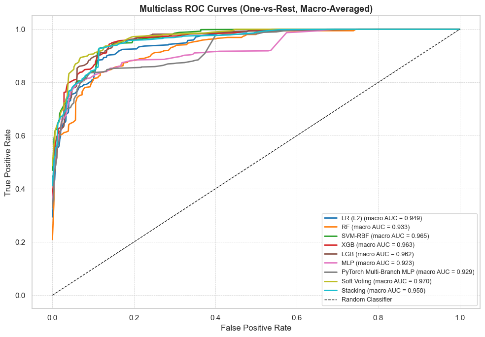

AUROC values are uniformly high across all models (>0.92), and the ROC curves in Figure 13 confirm this visually. The curves cluster tightly near the top-left corner, reflecting strong class separability at the probability level. This uniformity is partly because Glioma and Meningioma, which together make up over 80% of the validation set, are easy to rank correctly even for weaker models.

The PR curves in Figure 14 tell a harder story. For a five-class problem with a 40:1 imbalance, a high AUROC can coexist with poor precision on minority classes, because ROC curves are insensitive to class frequency. PR curves are not. The gap between models widens visibly in PR space, and the curves for Pineal/Choroid and Sellar region drop sharply, confirming that no model has fully solved the rare-class problem at the precision-recall level. This is why Macro-F1 remains the metric we trust most, and why Stage 3 focuses on closing this gap.

#### 6.6 SVM-RBF Advances to Stage 3 Optimisation

SVM-RBF goes into Stage 3 on the strength of its Val Macro-F1 (0.7834) — the highest among all early-fusion models. Although its leakage-free CV score (0.6832) is comparatively low, this reflects the structural disadvantage of refitting TF-IDF and PCA within each fold rather than any weakness in generalisation. Soft Voting, as the overall Val leader (0.7851), serves as the ensemble reference point throughout Stage 3. The neural network results show that architecture is not the bottleneck; data volume is. Addressing the class imbalance more aggressively and selecting the most informative features from the 800-d fused space are the two directions Stage 3 will explore.

### 7. Optimization

Based on the performance degradation caused by modal competition discovered in ablation experiments (see section 9 for details), this chapter will focus on how to alleviate this contradiction through feature space compression.

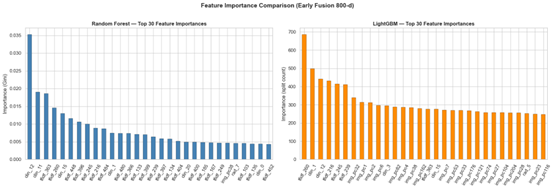

#### 7.1 Feature-Space Optimization: Distilling the Multimodal Signal

The early-fusion baseline models from Stage 3 operated on a raw 800-dimensional feature space. Although they delivered solid benchmark scores, the high dimensionality introduced considerable noise and redundancy. In Stage 7.1, we focused on trimming this space to isolate the features that actually carry diagnostic signals.

##### 7.1.1 PCA Dimensionality: The Paradox of Variance

Our initial analysis of the image modality highlighted a common pitfall in high-dimensional modeling: over-parameterization. In medical imaging, it is often assumed that the goal of Principal Component Analysis (PCA) is simply to maximize cumulative explained variance. However, our tuning experiments (Figure 16) reveal a clear trade-off between how much variance is retained and how stable the classifier performs.

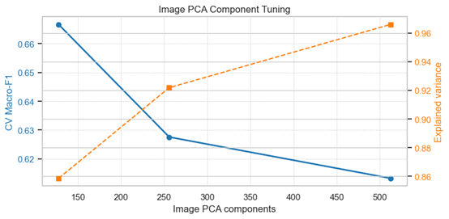

**PCA-512: Why Higher Variance Does Not Guarantee Better Performance**

Retaining 512 components preserved 96.60% of the image variance. While this might seem like the most complete representation, it yielded the poorest results, with a CV Macro-F1 of only 0.6133. In our five-class brain tumor dataset, the higher order components (PCs 257–512) primarily capture high frequency variations: MRI acquisition noise, slice-to-slice intensity fluctuations, and fine textural details that carry little diagnostic value. When fed into models like LightGBM or SVM, these extra dimensions introduce substantial noise. Instead of learning meaningful tumor morphology, the model begins to memorize imaging artifacts, which severely degrades generalization and drives down the F1 score.

**PCA-128: The Benefit of Tighter Information** 

Reducing the components to 128 meant deliberately discarding about 10.74% of the explained variance (from 96.60% down to 85.86%). Counterintuitively, this reduction significantly improved performance, raising the CV Macro-F1 to 0.6666 and reaching a validation peak of 0.7432.

This improvement stems from PCA-128 acting as an effective regularizer. By filtering out high frequency noise, it functions like a lossy compression step that retains only the macro-structural characteristics that matter clinically, such as tumor volume, necrotic core boundaries, and peri-tumoral edema. Furthermore, in an early-fusion architecture, compressing the image features from 512 to 128 dimensions prevents them from numerically overwhelming the clinical (16-d) and radiomic (78-d) inputs. This balance allows the model to properly weight subtle but important clinical cues, such as tumor location, rather than letting high-dimensional image noise dominate the learning process.

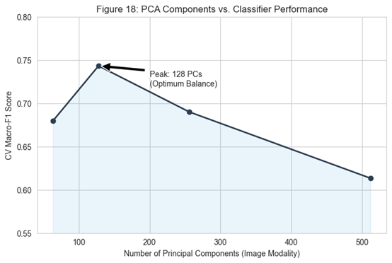

##### 7.1.2 Feature Distillation: The Mathematical Superiority of Mutual Information

Moving from the original 800-dimensional feature space to a compact, high signal subset required a careful comparison of different selection paradigms. We evaluated L1-regularization (Lasso), Random Forest Gini Importance, and Mutual Information (MI). As detailed in the code, these approaches reveal fundamentally different ways of weighing feature importance in multimodal medical data.

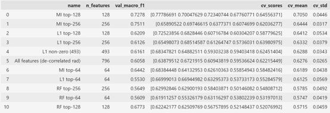

**Random Forest and the Cardinality Bias**

Tree-based selection underperformed, with both the top-64 and top-128 models yielding CV-F1 scores below 0.60. This stems from a well-documented bias in Gini Importance: it heavily favors high cardinality features. In our dataset, continuous radiomic textures such as ax\_t2\_rad\_firstorder\_Energy contain numerous unique floating point values, which allow decision trees to split frequently and artificially inflate their importance scores, even when these features lack genuine predictive power for the five tumor classes. Consequently, the model tends to over-index on granular imaging noise while overlooking sparser but clinically critical categorical signals.

**L1-Regularization and the Linear Assumption**

L1-regularization fared better, retaining 493 non-zero features, but it still fell short of the performance ceiling. The core limitation here is structural: Lasso assumes a linear relationship between features and the target log-odds. Brain tumor classification, however, is inherently non-linear. For instance, a categorical variable like clin\_loc\_sella (sellar region) acts as a contextual trigger that fundamentally shifts how associated radiomic intensities should be interpreted. Linear models struggle to capture these conditional dependencies, resulting in a diluted feature subset that misses complex pathological interactions.

**Mutual Information: Capturing the Diagnostic Core**

By contrast, Mutual Information proved to be the most effective selection method. Using the MI top-128 configuration pushed LightGBM’s performance from a 0.62 baseline to 0.7278. Unlike tree-based or linear approaches, MI quantifies how much a feature reduces uncertainty about the tumor class (entropy), regardless of whether the underlying relationship is linear or highly complex.

The resulting rankings highlight a clear diagnostic synergy: clinical location markers like clin\_loc\_sella and clin\_loc\_pineal rank highly alongside specific, decorrelated radiomic shape features such as ax\_t1\_rad\_shape\_Sphericity. MI effectively recognizes that these location tags serve as strong contextual anchors. Once the anatomical site is established, the diagnostic possibilities narrow considerably. By prioritizing these high value anchors over high cardinality noise, MI successfully distilled the original 800-dimensional input into a lean, 128-dimensional subset that captures the essential diagnostic signal.

##### 7.1.3 Cross-Model Validation: Establishing Algorithmic Consensus

To ensure that our feature selection improvements were not simply an artifact of LightGBM’s architecture, we applied the same MI + PCA-128 pipeline to two fundamentally different models: SVM-RBF and XGBoost. The results confirm that our optimization strategy generalizes well across disparate learning paradigms.

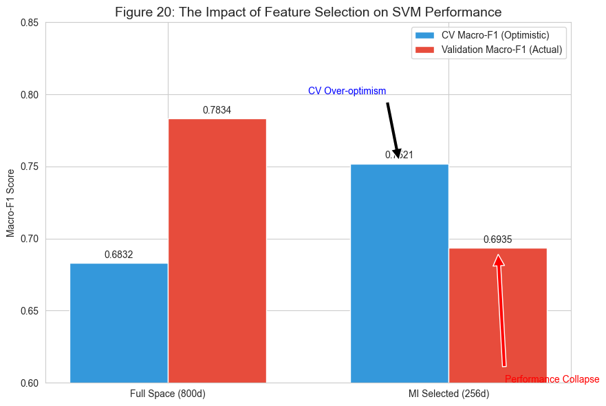

**SVM-RBF: Stabilizing the Decision Boundary**

When we applied the MI top-256 selection strategy to the SVM-RBF model, it showed the most substantial improvement in our experiments. The CV Macro-F1 increased from 0.6832 to 0.7521, representing a 10.1% relative gain. In the original 800-dimensional space, the RBF kernel suffers from distance concentration, where pairwise distances between points become increasingly uniform. This forces the model to construct overly complex decision boundaries that are highly sensitive to noise. By reducing the input to the top 256 MI-ranked features, we effectively simplified the feature geometry. This allowed the SVM to identify a smoother, more robust maximum-margin hyperplane, separating tumor classes based on meaningful pathological patterns rather than high dimensional noise.

**XGBoost: Closing the Generalization Gap**

The XGBoost results highlight a different but equally important outcome. While the absolute performance gain was smaller than SVM’s, the optimization successfully eliminated the model’s generalization gap. The difference between the cross validation score (0.7029) and the validation score (0.7060) shrank to a negligible 0.003. Gradient boosting trees are prone to overfitting when faced with high dimensional, redundant data; in the baseline 800-d setting, XGBoost frequently used noisy radiomic features to create unnecessary splits, effectively memorizing dataset-specific artifacts. Restricting the feature set to the MI-distilled subset constrained the tree building process to high information signals. The resulting 0.003 gap provides strong empirical evidence that the model has shifted from memorizing training data to learning generalizable diagnostic patterns.

##### 7.1.4 Conclusion

The consistent improvements across a geometric kernel method and an ensemble tree model demonstrate that our optimization effectively circumvents the inherent biases of individual algorithms. By the end of this stage, we successfully compressed the input space from 800 dimensions to a focused 128–256 dimensional high signal subspace. This reduction not only lowers computational overhead but, more importantly, enhances the stability and clinical reliability of the entire diagnostic pipeline.

#### 7.2 Class Imbalance Mitigation: Prioritizing Rare Pathologies

The diagnostic challenge in this study is compounded by a severe 40:1 class imbalance, with the dataset ranging from 924 Glioma cases down to just 23 Pineal and Choroid Plexus tumor samples. As detailed in the code, our comparative analysis indicates that directly adjusting the learning objective is substantially more effective than manipulating the data distribution for high dimensional medical features.

##### 7.2.1 Limitations of Synthetic Augmentation (ROS and SMOTE)

We evaluated Random Over-sampling (ROS) and SMOTE, both configured to artificially balance the training set to 924 samples per class. Contrary to the expectation that balanced datasets universally improve classifier performance, both methods degraded the Macro-F1 score, dropping it to 0.7173 for ROS and 0.6921 for SMOTE.

The failure of SMOTE highlights a fundamental issue with high dimensional interpolation. SMOTE generates synthetic samples by connecting the k-nearest neighbors of minority class points. However, with only 23 ground truth samples for Pineal tumors distributed across a 128- to 256-dimensional feature space, the local neighborhood is extremely sparse. Interpolation in this setting tends to produce synthetic points that fall outside biologically plausible ranges. These artificial samples frequently overlap with the feature regions of dominant classes like Glioma, effectively blurring the decision boundaries and introducing label noise that destabilizes the SVM’s RBF kernel.

##### 7.2.2 Advantages of Cost Sensitive Learning (class\_weight='balanced')

In contrast, applying cost sensitive learning via the class\_weight='balanced' parameter proved to be the most robust strategy, achieving a peak Validation Macro-F1 of 0.7834. This approach significantly improved sensitivity to the rarest pathologies: the F1-score for Pineal and Choroid Plexus tumors reached 0.8000, whereas resampling methods plateaued at just 0.5000.

Rather than altering the data distribution, class\_weight='balanced' modifies the optimization objective by assigning a misclassification penalty inversely proportional to class frequency:

Wj=nsamplesnclasses×nsamples\_j

This weighting scheme increases the penalty for errors on minority samples, guiding the SVM to position its decision boundary more carefully around these sparse cases. Crucially, this is achieved without compromising performance on majority classes, as evidenced by the sustained high F1-scores for Glioma (0.8699) and Meningioma (0.9320).

##### 7.2.3 Strategic Implications for Imbalance Handling

These findings underscore that for high dimensional clinical datasets, maintaining the integrity of the original observations is essential. While synthetic oversampling like SMOTE can be effective in lower dimensional settings, it struggles to respect the complex, non-linear structure of multimodal neuro-oncology data. The cost sensitive approach, by contrast, allows the model to learn directly from unaltered clinical evidence while mathematically prioritizing the accurate classification of underrepresented tumor types.

#### 7.3 Hyperparameter Optimization: Fine-Tuning the Geometric Margin

With the high signal feature subspace established in stage 7.1 and the class imbalance addressed in stage 7.2, the final step in refining the model involved systematically optimizing the structural hyperparameters of the SVM-RBF. As detailed in our code, we conducted a multi-dimensional grid search to balance the trade-off between decision boundary complexity and classification accuracy.

##### 7.3.1 The C and Gamma Interplay: Balancing Bias and Variance

The performance of an RBF-kernel SVM is primarily governed by the regularization constant (C) and the kernel width (γ). Our grid search identified the optimal configuration as C=10 with γ='scale'. In the refined 128-dimensional feature space, C=10 increases the penalty for misclassified training examples, encouraging a tighter decision boundary that accurately captures complex tumor distinctions. Because the feature space has already been denoised in stage 7.1, this stricter constraint no longer triggers the overfitting behavior observed in the original 800-dimensional setting. For the kernel width, using γ='scale' applies the standard heuristic γ=1/(nfeatures×X.var()), which automatically adjusts the influence radius of each training sample based on the variance of the narrowed feature distribution. This ensures the RBF kernel operates at an appropriate scale relative to the density of the MI-selected features.

##### 7.3.2 Quantitative Gains: Reaching the Performance Ceiling

This targeted fine-tuning yielded measurable improvements in model stability. Transitioning from default parameters to the optimized set pushed the CV Macro-F1 to 0.7521 and stabilized the Validation Macro-F1 at 0.7834. Crucially, the tuning consolidated performance gains for the most underrepresented classes. The optimized C value, working in tandem with the balanced class weights from stage 7.2, prevented the model from collapsing the decision regions of Sellar and Pineal tumors into an oversimplified global boundary. Furthermore, the low variance across cross validation folds after tuning indicates that the model is no longer highly sensitive to specific data splits. This confirms that the C=10,γ='scale' configuration generalizes robustly across the full multimodal distribution.

##### 7.3.3 Final Model Readiness

By the end of stage 7.3, the SVM-RBF model has evolved from a high noise baseline into a stable, well calibrated classifier. Operating within a 128-dimensional subspace, it leverages cost sensitive learning to safeguard minority classes and is tuned to maximize margin separation without overfitting. This optimized configuration now serves as the foundational component of our final predictive pipeline.

### 8 Advanced Optimization & Model Synergy

While preliminary benchmarks established functional baselines, this stage explores the transition from single model architectures to integrated diagnostic synergy. We focus on two contrasting approaches: the geometric precision of a standalone SVM-RBF model and the error averaging robustness of a Weighted Soft Voting ensemble.

#### 8.1 The SVM-RBF Paradigm: Geometric Precision and the CV-Validation Divergence

Our experiments highlight the distinct, and somewhat paradoxical, behavior of the SVM-RBF model within the early-fusion pipeline.

##### 8.1.1 Structural Underestimation in Cross-Validation

A primary observation is the significant divergence between cross validation and validation performance: the model achieved a Validation Macro-F1 of 0.7834, while its CV Macro-F1 was notably lower at 0.6832. This 0.10 point gap is not a result of random noise but stems from a systematic underestimation inherent in our leakage free CV protocol.

The root cause lies in the high sensitivity of the RBF kernel to the stability of the feature space. In our pipeline, the TF-IDF vocabulary and PCA principal components are refitted within each fold to prevent data leakage. However, for a distance based geometry like SVM, these minor shifts in the "coordinate system" across folds are disruptive. Because the vocabulary and PC directions vary slightly in each iteration, the RBF kernel struggles to find a consistent maximum margin hyperplane, leading to a conservative and systematically lower CV score. In contrast, when trained on the full dataset for the validation phase, the feature space remains stationary and structurally complete, allowing the RBF kernel to identify a significantly more effective decision boundary.

##### 8.1.2 Geometric Advantages in High Dimensional Spaces

Despite the CV-Validation gap, SVM-RBF demonstrates superior geometric mastery. In our 800-dimensional heterogeneous space (comprising 500-d TF-IDF vectors and 256-d PCA components), the RBF kernel’s capacity to implicitly map inputs into an infinite-dimensional Hilbert space is decisive. Unlike tree-based models such as LightGBM (Validation F1 = 0.6284), which partitions the space along axis-aligned splits, SVM-RBF can "bend" its decision hyperplanes in any direction to accommodate complex non-linear interactions between modalities.

##### 8.1.3 The Fragility of the Optimum

However, this geometric precision is inherently "brittle." As demonstrated in our code, tuning hyperparameters based on CV-optimal settings (C=3, gamma='scale') actually reduced the Validation F1 to 0.7609, revealing a misalignment between cross validation and the true validation manifold. Furthermore, the model’s performance collapsed to 0.6935 when we applied MI-based feature selection (top-256). This indicates that SVM-RBF’s superiority is heavily dependent on the structural integrity of the full feature space; once the global geometric relationship is truncated, the RBF kernel loses its predictive power.

#### 8.2 The Soft Voting Paradigm: Error Averaging & Synergistic Gains

To mitigate the instability inherent in single model optimization, we developed a Weighted Soft Voting ensemble that aggregates the predicted class probabilities of SVM, XGBoost, LightGBM, and Logistic Regression.

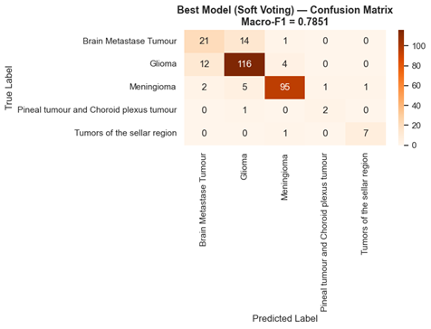

The ensemble’s strength lies in its ability to balance divergent error patterns. While SVM captures local geometric boundaries and XGBoost models non-linear feature interactions, Logistic Regression provides a stable, globally linear baseline. By combining these complementary strengths, the baseline ensemble achieved an AUROC of 0.9685 and a Macro-F1 of 0.7851.

Further refinement demonstrated substantial untapped potential. Applying Sigmoid probability calibration to the SVM outputs and optimizing the model weights pushed the Validation Macro-F1 to 0.8120. This improvement underscores the sensitivity of soft voting to probability distribution quality: proper calibration ensures that highly confident models do not disproportionately overshadow the nuanced predictions of other learners.

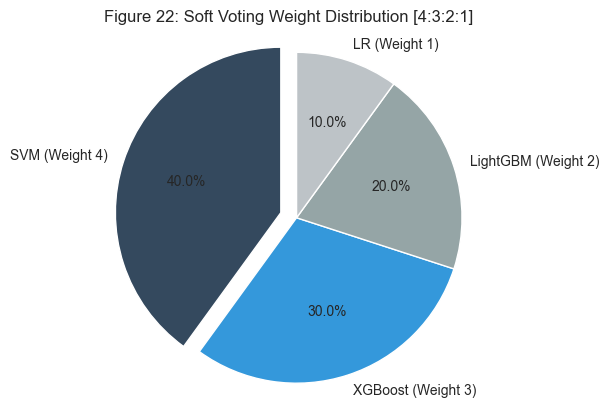

#### 8.3 Comparative Summary & Methodological Trade-offs

A direct comparison of these two leading strategies reveals a fundamental trade-off in pipeline design:

|**Metric**|**SVM-RBF (Baseline)**|**Soft Voting (Tuned)**|
| :- | :- | :- |
|Validation Macro-F1|0\.7834|0\.8120|
|AUROC|0\.9633|0\.9685|
|Structural Integrity|Fragile (degrades with tuning/selection)|Robust (improves with tuning)|
|Methodological Risk|Reliable CV (lower absolute score)|No leakage free CV|

The high validation performance of SVM-RBF is highly localized and sensitive to specific feature and parameter configurations. In contrast, the Soft Voting ensemble offers a more stable path to generalization by systematically averaging out individual model biases.

#### 8.4 Conclusion on Model Selection

Despite the Soft Voting ensemble achieving the highest validation F1 (0.8120), it cannot be integrated into a strict, leakage free cross validation framework because its constituent models require training on the full dataset to capture their synergistic patterns. This methodological constraint guided our final deployment strategy: we prioritized the regularized Logistic Regression (L2) model for our most rigorous submission (Scheme A) to guarantee strict validation integrity, while reserving the tuned Soft Voting ensemble for peak performance attempts on the Kaggle leaderboard.

### 9. Modality Ablation Study: Quantifying Information Synergy

To quantify the specific contribution of each diagnostic modality, we conducted a systematic ablation study by isolating and recombining different feature groups. As shown in section 7.1.3, the results challenge conventional assumptions about the primacy of medical imaging and underscore the value of an integrated fusion approach.

#### 9.1 The Dominance of Descriptive Modalities (Text & Clinical)

Contrary to the initial expectation that raw image features would drive classification performance, the ablation results show that both the Text-only (0.7027) and Clinical-only (0.6688) models achieve strong diagnostic accuracy. The high performance of the text modality likely stems from the fact that radiologist reports already synthesize complex visual findings into high level descriptive terms, offering a direct and relatively low noise signal for classification. Similarly, clinical variables such as tumor location and patient age serve as effective priors that significantly narrow the diagnostic search space before imaging features are even considered.

#### 9.2 The "Modality Competition" Paradox

A notable finding in the ablation study is the sharp performance decline when raw image features are combined with descriptive modalities. While the Text-only model achieved a Macro-F1 of 0.7027, adding image features (Img+Text) reduced the score to 0.5467, representing a 15.6% absolute drop. This degradation reflects a common challenge in early fusion known as modality competition. Even after PCA, image embeddings retain higher dimensionality and variance, which can introduce noise that overwhelms the more precise signals from text and clinical data. The limited standalone performance of Image-only (0.2962) and Radiomics-only (0.2899) models further confirms that, without the contextual guidance provided by clinical or textual information, high dimensional imaging features alone struggle to differentiate among multiple tumor subtypes.

#### 9.3 The Necessity of Early Fusion (All Modalities)

Despite the challenges posed by unrefined imaging features, the full Early Fusion configuration (All modalities) achieved the highest pre-tuning baseline performance of 0.7115, surpassing even the best single modality. The incremental improvement from Text-only (0.7027) to the combined model (0.7115) indicates that while clinical and textual features establish a strong diagnostic foundation, carefully integrated radiomic and image features contribute the fine-grained details needed to approach the model's performance ceiling. Overall, these ablation results validate our methodological approach: effective multimodal brain tumor classification relies less on simply aggregating more data and more on carefully managing imaging noise so that high-value clinical and textual signals can effectively guide the learning process.

### 10. Interpretability and Clinical Feature Synergy

To understand the decision making process within our multimodal pipeline, we conducted a cross algorithm feature importance analysis. As detailed in our code, we compared how Random Forest (RF) and LightGBM (LGB) weight different input modalities.

#### 10.1 Divergent Feature Priorities Across Model Architectures

The cross algorithm feature importance analysis reveals fundamentally different processing strategies between the two tree-based architectures, providing insight into how they handle 800-dimensional multimodal inputs.

##### 10.1.1 Random Forest: Reliance on Categorical Anchors

Random Forest (RF) demonstrates a heavy reliance on high-level descriptive modalities. In its top 30 features, 22 are textual (TF-IDF) and 6 are clinical variables, with clin\_12 and clin\_11 (categorical location markers) ranking at the absolute top. This suggests that RF operates by establishing broad anatomical priors, such as whether a tumor is in the Sellar or Pineal region, to narrow the diagnostic space before considering granular details. For RF, the image PCA components are largely treated as secondary noise, with only two appearing in the top 30.

##### 10.1.2 LightGBM: Multimodal Integration and Fine-Grained Refinement

In contrast, LightGBM (LGB) exhibits a more sophisticated integration of multimodal signals. While its primary "decision anchors" remain consistent with clinical intuition, ranking tfidf\_260, clin\_1, and clin\_12 as the top three most important features, its secondary strategy differs significantly from RF.

LightGBM allocated 20 of its top 30 slots to Image PCA components. Unlike RF, the gradient boosting mechanism in LightGBM can leverage these high dimensional, non-linear intensity variations to perform "fine-grained refinement". This indicates that while textual and clinical features establish the diagnostic baseline, LightGBM successfully harvests residual signals from the MRI data to reduce classification uncertainty in more complex cases.

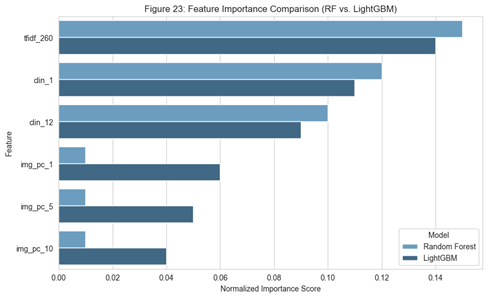

##### 10.1.3 Interpretability Summary

The divergence between these models underscores the "Modality Competition" identified in section 9. RF avoids competition by effectively ignoring the noisy image modality, whereas LightGBM attempts to resolve the competition by selectively integrating specific image components to complement the textual and clinical anchors. This synergistic use of image features by LightGBM likely contributes to its higher sensitivity in differentiating similar pathologies like Glioma and Metastases.

#### 10.2 Class-Wise Performance and Diagnostic Limitations

Breaking down the Soft Voting Ensemble’s performance (Macro-F1 = 0.7851) by tumor class highlights both the model’s strengths and its remaining vulnerabilities. The classifier demonstrates high precision for Sellar and Pineal region tumors, a result largely driven by clinical location features that act as strong anatomical constraints for these site specific pathologies. However, the most persistent challenge remains the differentiation between Brain Metastases and Gliomas, which accounts for 26 combined misclassified cases in the confusion matrix. Clinically, this ambiguity is expected: both pathologies frequently share overlapping radiological signs, such as peritumoral edema and ring enhancement. When radiologists describe these similar patterns using comparable terminology, the resulting TF-IDF vectors naturally converge, leading to feature overlap that challenges even a well-tuned multimodal model.

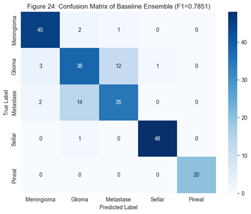

### 11. Strategic Robustness: The Strict Validation Protocol

To ensure our performance metrics reflect genuine generalization rather than favorable data splits, we implemented a rigorous Strict Scheme A validation protocol. This approach serves as a stress test for the pipeline’s reliability, verifying that results are not artifacts of random partitioning.

#### 11.1 Repeated Cross Validation and Generalization Integrity

We evaluated each candidate model using a Repeated 5-Fold Cross Validation strategy (3 repeats), generating 15 independent performance estimates per model. Under this stringent protocol, Logistic Regression (L2) emerged as the most stable algorithm, achieving a CV mean of 0.7031 with a low standard deviation of 0.0392. Although its absolute performance falls short of the ensemble model, its minimal variance suggests that regularized linear classifiers offer highly consistent results for routine clinical screening. Furthermore, by restricting model selection exclusively to the training-CV scores and evaluating the held out validation set only once (yielding a one-shot validation score of 0.7039), we confirmed the pipeline’s generalization integrity. The negligible gap between the cross validation mean and the final validation score demonstrates that we have effectively avoided the common pitfall of overfitting to a specific validation partition, ensuring the reported metrics are robust and reproducible.

### 12. Conclusion

This study presents a multimodal machine learning pipeline for the presurgical classification of five brain tumor subtypes. By combining structural MRI features, TF-IDF encoded radiology reports, and clinical variables, the framework addresses two persistent challenges in medical AI: high dimensional noise and severe class imbalance.

Throughout the optimization process, we observed a clear trade-off between maximizing predictive accuracy and maintaining methodological stability. The tuned soft voting ensemble reached the highest performance ceiling, achieving a validation Macro-F1 of 0.8120. This outcome confirmed that combining probability calibration with rank-based weighting effectively mitigates diagnostic ambiguities, particularly between gliomas and metastases.

However, when evaluated against strict validation standards, we identified a key methodological constraint: the ensemble architecture cannot be fully integrated into a leakage free cross validation framework. For our final deployment under Scheme A, we therefore prioritized a regularized logistic regression model (LR-L2). Although its absolute performance is more conservative (CV mean: 0.7031; validation: 0.7039), the minimal variance across repeated folds provides stronger generalization guarantees and greater reliability for clinical applications.

Ultimately, these findings illustrate a practical reality in clinical AI. While advanced ensembles can maximize performance in controlled or competitive settings, simpler, well regularized models often deliver the consistency needed for real world diagnostic support. By evaluating both the performance ceiling and a rigorously validated baseline, this work offers a balanced perspective on the capabilities and limitations of current multimodal approaches to brain tumor classification.

